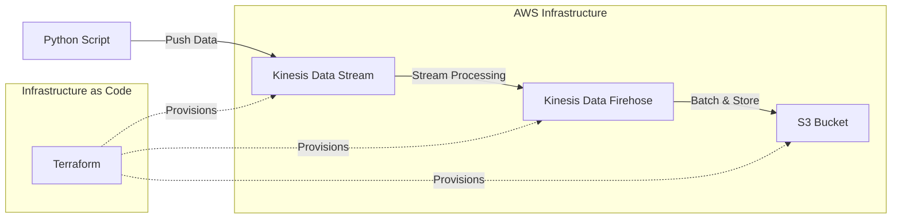

# Kinesis Data Pipeline

A scalable data streaming pipeline that ingests data through Amazon Kinesis Data Streams, processes it via Kinesis Data Firehose, and stores it in Amazon S3 for analytics and long-term storage.

## Architecture



## Overview

This project implements a serverless data pipeline using AWS services to handle real-time data streaming and storage:

- **Data Ingestion**: Python script pushes data to Kinesis Data Streams
- **Stream Processing**: Kinesis Data Firehose buffers and transforms the data
- **Data Storage**: Processed data is stored in S3 for analytics and archival
- **Infrastructure**: All AWS resources are provisioned and managed using Terraform

## Features

- **Real-time Data Streaming**: Handle continuous data ingestion with Kinesis Data Streams
- **Automatic Batching**: Kinesis Data Firehose automatically batches data for efficient S3 storage
- **Scalable Architecture**: Serverless components that scale automatically based on demand
- **Infrastructure as Code**: Complete infrastructure management with Terraform
- **Cost-Effective**: Pay-per-use model with automatic scaling

## Prerequisites

- Python 3.8+
- AWS CLI configured with appropriate permissions
- Terraform >= 1.0
- AWS Account with sufficient permissions for Kinesis, S3, and IAM

## Project Structure

```
├── terraform/
│   ├── main.tf
│   ├── variables.tf
│   ├── outputs.tf
│   └── terraform.tfvars.example
├── src/
│   ├── data_producer.py
│   └── requirements.txt
├── README.md
└── .gitignore
```

## Setup Instructions

### 1. Clone the Repository

```bash
git clone <repository-url>
cd kinesis-data-pipeline
```

### 2. Configure AWS Credentials

Ensure your AWS credentials are configured:

```bash
aws configure
```

### 3. Deploy Infrastructure

Navigate to the terraform directory and deploy the infrastructure:

```bash
cd terraform
cp terraform.tfvars.example terraform.tfvars
# Edit terraform.tfvars with your specific values
terraform init
terraform plan
terraform apply
```

### 4. Install Python Dependencies

```bash
cd ../src
pip install -r requirements.txt
```

### 5. Run the Data Producer

```bash
python data_producer.py
```

## Configuration

### Terraform Variables

Key variables to configure in `terraform.tfvars`:

- `kinesis_stream_name`: Name of the Kinesis Data Stream
- `firehose_delivery_stream_name`: Name of the Kinesis Data Firehose delivery stream
- `s3_bucket_name`: Name of the S3 bucket for data storage
- `aws_region`: AWS region for resource deployment

### Python Script Configuration

Configure the following in your Python script:

- AWS region
- Kinesis stream name
- Data format and schema
- Batch size and frequency

## Architecture Components

### Kinesis Data Streams
- Provides real-time data streaming capabilities
- Handles multiple producers and consumers
- Configurable shard count for throughput scaling

### Kinesis Data Firehose
- Automatically buffers and batches streaming data
- Supports data transformation and compression
- Direct integration with S3 for storage

### Amazon S3
- Stores processed data in a structured format
- Supports partitioning for efficient querying
- Integrates with analytics services like Athena and Redshift

## Monitoring and Logging

The pipeline includes monitoring through:

- **CloudWatch Metrics**: Monitor stream throughput, error rates, and latency
- **CloudWatch Logs**: Capture application and service logs
- **AWS X-Ray**: Distributed tracing for performance analysis

## Security

Security measures implemented:

- **IAM Roles**: Least privilege access for all services
- **Encryption**: Data encrypted in transit and at rest
- **VPC**: Network isolation where applicable
- **Access Logging**: S3 access logging enabled

## Cost Optimization

- **Data Compression**: Firehose compresses data before S3 storage
- **Intelligent Tiering**: S3 lifecycle policies for cost optimization
- **Right-sizing**: Appropriately sized Kinesis shards based on throughput requirements

## Troubleshooting

### Common Issues

1. **Permission Errors**: Ensure IAM roles have necessary permissions
2. **Stream Throttling**: Increase shard count or implement exponential backoff
3. **Data Format Issues**: Validate JSON structure and encoding

### Monitoring Commands

```bash
# Check Kinesis stream status
aws kinesis describe-stream --stream-name <stream-name>

# Monitor Firehose delivery stream
aws firehose describe-delivery-stream --delivery-stream-name <stream-name>

# List S3 objects
aws s3 ls s3://<bucket-name>/
```

## Contributing

1. Fork the repository
2. Create a feature branch (`git checkout -b feature/amazing-feature`)
3. Commit your changes (`git commit -m 'Add some amazing feature'`)
4. Push to the branch (`git push origin feature/amazing-feature`)
5. Open a Pull Request

## License

This project is licensed under the MIT License - see the [LICENSE](LICENSE) file for details.

## Support

For questions and support:

- Create an issue in this repository
- Check AWS documentation for service-specific questions
- Review CloudWatch logs for debugging

## Cleanup

To avoid ongoing charges, destroy the infrastructure when no longer needed:

```bash
cd terraform
terraform destroy
```

**Note**: Ensure S3 bucket is empty before destroying infrastructure.
